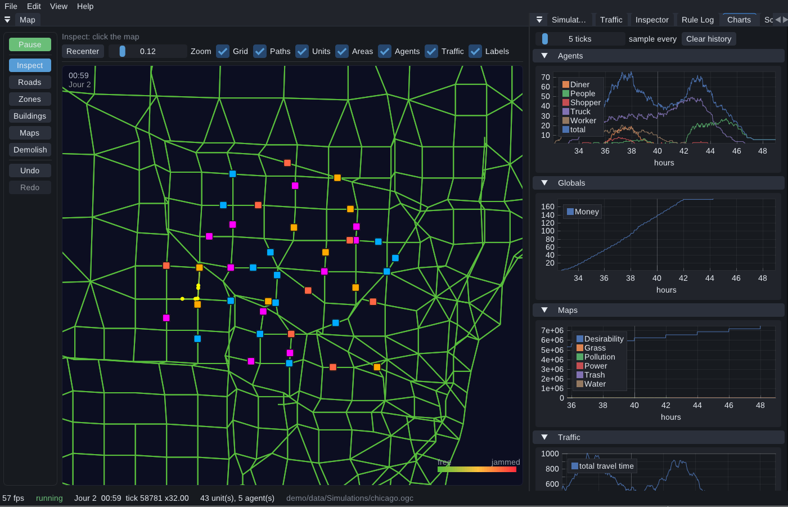

# Using the demo application

The city view holds a SimCity-style vertical rail on its left. From top to bottom: **Play / Pause**, then the six tools: **Inspect**, **Roads**, **Zones**, **Buildings**, **Layers**, **Demolish**: then **Undo** and **Redo**. Keys `1` to `6` select a tool; the space bar toggles pause.

The row to the right of the rail holds the settings of the selected tool, and only those:

- **Inspect** highlights whatever is under the cursor: a building, an agent, a road, a node, a zone, or the grid cell when there is nothing else: and a click sends it to the Inspector panel. A building standing on a junction hides its node, since that is what you pointed at. This is the only tool that highlights cells; the others show the footprint of what they are about to do instead.
- **Roads** drags a segment of the chosen segment type. Both ends snap to a nearby node, and otherwise to the world grid.
- **Zones** and **Layers** paint a rectangle. Click for a single square of the brush size, or drag for a rectangle. Zones do not overlap: painting Commercial over part of a Residential rectangle re-zones exactly the cells you painted and leaves the rest residential.
- **Layers** paints a resource on the cells, and raises the **Layers** panel, where each row toggles the visibility of a layer, sets its opacity, and picks how it is drawn: filled cells, contours, or numeric values. Clicking a name makes it the main layer; Alt+clicking shows it alone. A simulation opens with one layer shown, because half a dozen heatmaps stacked on the same cells cannot be read. Reading a heatmap needs no brush, so the panel can be left open whatever the armed tool.
- **Buildings** drops a building on a road. The segment is cut in two and the building sits on the junction, so agents have somewhere to stop; clicking an existing node builds there instead. Buildings grown by a zone are anchored at an offset along a segment and cut nothing, which is what keeps a street of forty houses a single segment.
- **Demolish** removes a building, a road, or an orphan node, and holds **Clear city**, which throws away everything that was built but keeps the ruleset, so roads can be laid again straight away. That one cannot be undone; everything else can, with Ctrl+Z and Ctrl+Y.

**Recenter** and the **Zoom** slider sit on the row below, next to the display toggles. **Zones** is the one that is not a plain checkbox: a zone is a translucent rectangle, so drawn over a layer it tints the cells under it and the colour no longer reports the amount the layer holds. Its default, `auto`, draws the zones only while no layer is drawn; `on` and `off` decide instead. You can also pan by dragging with the middle or right button, zoom with the wheel, and frame the whole city with the Home key.

The **Simulation clock** panel holds the speed buttons, from x0.25 to x32, and the time of day. Two fields and **Set time** move the calendar where you want it, which matters because a rule that keeps office hours does nothing outside them: a save written at half past midnight looks dead until eight in the morning. While paused, **Step** runs a number of ticks one after the other, so a rule with a period of three ticks and one with a period of seven each land on their own tick; **1 min** and **1 h** queue the ticks of a game minute and of a game hour.

Files are handled through File → New city, Open ruleset (`.ogs`), Open city, and Save city (`.ogc`). The Script panel edits the open `.ogs`; **Apply** reparses it, keeping the city as long as every type it still uses is defined by the new ruleset. Its **Checksum** section reads the fingerprint of the ruleset, of the text being edited, and of the open save, and re-stamps the save with the current one. While a ruleset is being written, that fingerprint changes at every save, so File → **Open saves with a stale checksum** waives the check; the types a save names are still required to exist.

Simulation clock, Layers, Inspector, Rule Log, Charts, Traffic, History, and Script are dockable panels, listed under the View menu. Arming the Inspect or the Layers tool brings up the panel it works with. A layout saved before a panel existed leaves it floating, which View → **Reset the panel layout** undoes. The canvas shows `Jour N  HH:MM` in its top-left corner and tints the background through night, dawn, day, and dusk; the charts use game hours on the X axis.

The **Traffic** panel is the one whose numbers need context. The smoothing weight, the route check period, and the cost deviation decide how quickly the network reacts and how often an agent reconsiders its itinerary, and the relative gap reports how far the city is from a state where nobody could find a cheaper route. All four are explained in the [traffic documentation](traffic.md). The gap is measured on a sample of the agents and refreshed once per tick rather than once per frame, since each agent examined costs a whole graph search; `TrafficConfig::relativeGapSamples` sets the size of that sample.

The **Charts** panel draws every series twice: the raw samples, and a moving average of them under the **Trend** toggle. Population and money move in steps as a rule fires, and the average is there to make the direction readable. It is drawn and nothing more, the simulation never reads it.

For the ruleset language itself, see the [script language reference](script.md).
