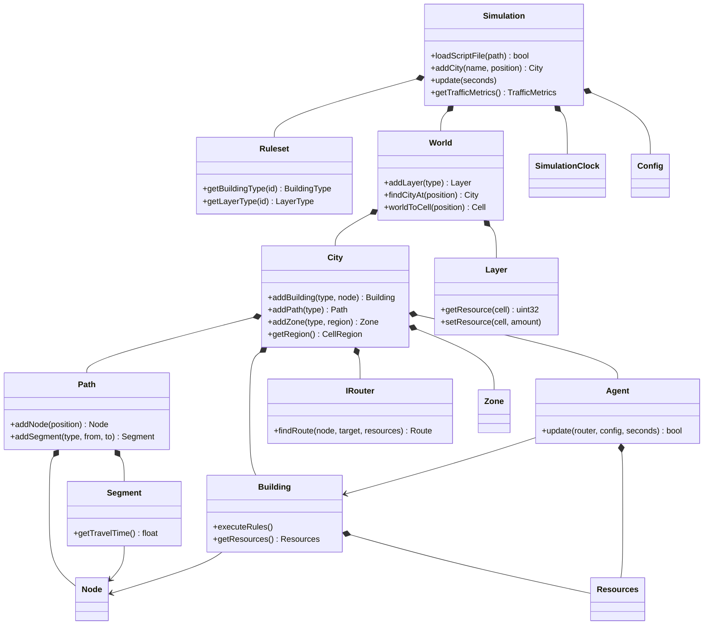
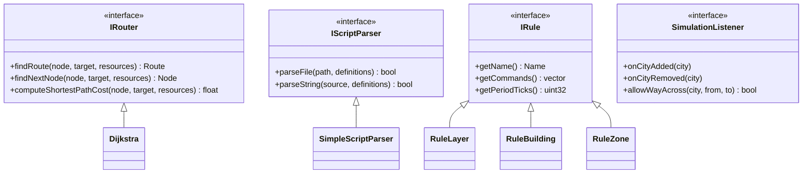

# The engine, class by class

The GlassBox approach describes a city simulation as data rather than as a tree of objects with an `Update()` method. Every engine class lives in `include/OpenGlassBox` and is documented there. The following sections explain what each class represents and why it exists separately.

Gameplay itself is defined in `.ogs` scripts; see the [script language reference](script.md).

- **Zones** are zones whose rules spawn, upgrade, and demolish buildings.
- **Layers** are 2D fields over the grid, such as water, pollution, and desirability.
- **Buildings** are buildings that hold bounded stocks of resources.
- **Agents** carry resources from one unit to another.
- **Resources** are named stocks such as money, goods, or people.
- **Paths** are networks made of nodes and segments on which agents travel.
- **Rules** move resources between them and define the gameplay.

## The classes at a glance

Sixteen classes, and two or three methods each: enough to place the rest of this document, not enough to replace it. A filled diamond reads "owns and destroys", an arrow reads "refers to, without owning". The recipes of `Types.hpp` are left out on purpose; the section below says what they are better than another box would.

Four places are meant to be replaced, and they are kept out of the diagram above so it stays about the game rather than about the seams. Each is an interface with what the engine ships behind it:

`SimulationListener` is one interface used under two names: `Simulation::Listener` and `World::Listener` are aliases of it, since a city appearing and a road crossing a border are the same kind of news to whoever is drawing the game.

## The two halves: recipes and things

Nothing in the engine is hard-coded, and that split runs through the whole design. A ruleset declares **recipes**: a kind of house, a kind of road, a kind of traveller: and a running city holds **things** built from them. `Types.hpp` holds the recipes (`BuildingType`, `SegmentType`, `AgentType`, `LayerType`, `ZoneType`, `PathType`); `Building`, `Segment`, `Agent`, `Layer`, `Zone`, and `Path` are the things.

A thing keeps a `const&` to its recipe rather than a copy of it. A thousand houses share one `BuildingType`, so a house costs what it actually holds and nothing more. The price of that is a lifetime rule which is worth remembering, because breaking it is the one way to make the engine misbehave in a way that is hard to debug: **the ruleset has to outlive every city loaded from it**. `Simulation` declares its `Ruleset` before its `World` for exactly that reason, so that destruction, which runs in reverse, takes the cities away first.

### The containers: Simulation, World, City

| Class        | What it is                                                        | What it owns                     |
| ------------ | ----------------------------------------------------------------- | -------------------------------- |
| `Simulation` | The whole game, and where a program starts                        | the ruleset and the world        |
| `World`      | The ground: one grid, one calendar, the layers of the environment | the layers, the clock, the cities |
| `City`       | One city: its roads, buildings, travellers and zones              | everything a city is made of     |

`Simulation` also owns the conversion from wall time to game time. You hand `update()` the seconds elapsed since the last frame; it scales them by the speed the player chose, accumulates them, and runs as many **fixed ticks** as fit. A slow machine therefore falls behind rather than simulating differently, and a save made on one machine replays on another.

`World` exists because two cities that touch have to share their environment: pollution does not stop at a boundary. The layers live there, not in the cities, and what a `City` holds on the grid is the rectangle of cells it administers: a `CellRegion`. That region is what bounds every rule run on its behalf, so a city never reads over its neighbour's shoulder.

`World` also owns the **order of a tick**, which is not arbitrary: the cities move their agents and run their buildings first, then the layers run their own rules. Agents move before buildings look around so that a building sees who has just arrived, and the layers come last so that a cell reflects everything that happened during the tick.

## The road network: Path, Node, Segment

A `Path` is a graph, and the only thing an `Agent` may travel on. `Node` is a vertex: a crossroads, and an address a building may sit on. `Segment` is an edge: a street, undirected, since one-way traffic is not modelled.

A city may hold several `Path` objects and they never meet: a road network and a rail network are two of them, and the router never leaves the one it started on. That is the whole of the separation, and it is enforced in one place rather than checked everywhere.

A `Segment` knows its length, how many agents are on it, and from those two how long it takes to drive. That travel time, not the length, is what the router minimises: see [how traffic is modelled](traffic.md).

Both containers are `std::deque` rather than `std::vector`, and that is deliberate: everything refers to a crossroads or a street **by address**, so adding one must not move the others.

Two streets that cross share a `Node` or they share nothing: the graph knows no such thing as an overpass, and an agent reaching a crossing that is only drawn carries straight on through it. `Path::findCrossings` reports where a straight line meets the streets already laid, and the caller cuts them with `City::splitSegment`. It reports and does not cut because only the caller knows which identifiers to hand out and how to take the edit back, which is what the demo needs for its undo. Whether the lines of a network meet at all is `PathType::crossings`, from the script.

`City::moveNode` moves a crossroads. The streets meeting there keep their ends and measure themselves again, so the router charges for the road as it now is, and the buildings anchored to them read their position back. Agents are not moved: they are where they are, on streets that cost something else to drive, and their itineraries are computed again on the next tick.

## The actors: Building, Agent, Zone

`Building` is a building. It holds resources, it runs its rules once every so many ticks, and those rules send agents out. A `Building` is **not** a graph node: a distinction worth dwelling on, because it is the one place this port departs most from the original. A building has its own position and, separately, an *anchor* on the network: a `Node`, or a `Segment` at an offset. Anchoring along a street is what keeps the graph small; a street of forty houses used to become forty crossroads and forty-one segments, and the router paid for all of them at every tick.

`Agent` is one trip: a load of resources leaving a building and looking for another that will take it. Agents run no rules: a city may have a thousand alive at once: and they do not know where they are going. The router finds the cheapest building that answers to the name they are looking for *and has room*, and the answer changes as the traffic does. Room counts the agents already on their way there, so that a shop with one free shelf is claimed by one agent and not by the twenty that were dispatched on the same tick. An agent that finds nothing wanders, and after `agentGiveUpTicks` it hands its load back to the building that sent it out. Wandering means the city is short of somewhere to deliver, not that the router is broken.

`Zone` is a zone the player painted, and the piece that turns an empty grid into a city. It owns its footprint and nothing else: the buildings it grew belong to the `City`, which is why it counts them by walking the city rather than keeping a list of pointers that would outlive what they point at.

`Building` and `Agent` share a base, `Entity<TYPE>`, holding the four things both have: an identifier, a recipe, a colour, and a position. `Node` and `Segment` deliberately do not inherit from it: they have no colour of their own and no identity outside the `Path` numbering them.

## The environment: Layer

A `Layer` is one field: coal, water, forest, but also pollution, land value or desirability. Every cell holds an amount of that one thing, capped by the recipe of the layer, so nothing piles up without bound in one place.

A `Layer` is what lets a rule ask a question about a *place* rather than about a building: "is there water within three cells of here?" A building reads and writes its neighbourhood through its **footprint**, a radius around the cell it stands on, and that radius is a taxicab distance: a diamond, not a circle. `CellsInRadius` walks that diamond, reusing its buffers because a layer runs this for every cell of every city on every tick. `RandomCells` is the other walker: it hands out a share of the cells of a region, drawn so that every subset of that size is equally likely, but scanned in reading order so that the cells come out in the order the grid stores them.

The grid is unbounded in the four directions, so cell coordinates are signed, and storage is sparse: blocks of 16×16 cells allocated the first time something is written into them. An empty layer costs nothing and a city can be founded anywhere without deciding on a size beforehand. `getBlockCount()` makes the cost visible in the debug panel.

## The rules: Rule, RuleCommand, RuleValue

This is the scripting language at runtime, and it is smaller than you would expect.

- `IRule` is a name, a period, and a list of commands. `RuleBuilding`, `RuleLayer` and `RuleZone` add what each kind needs: a fallback for a building, a random sample of the cells for a layer, nothing for a zone.
- `IRuleCommand` is one line of a rule. Every command is asked **twice**: `validate()`, then `execute()`. A rule asks all of its commands first and applies them only if every one agreed, which is what makes a rule atomic: "take a person out of the house and put them in a car" either does both or does neither, so nobody is ever lost between the two.
- `IRuleValue` is somewhere a command reads a number from and writes one back to: `local`, `global`, or `layer`. Having them behind one interface is what lets a single `add` command serve all three: the command knows *how much*, the value knows *where*.
- `RuleContext` is everything a rule may look at while it runs: the city, the building or the cell, the clock, the resources. Rules hold no state of their own: they are shared by every entity that lists them: so all of the "where" has to be handed to them. The context is held by the entity and reused from tick to tick, since a layer rule fires over thousands of cells.

`IRule::Listener` is a single global observer of every attempt to run a rule, reporting **which command refused**. That is the answer to "why does this rule, which looks right, never do anything?", and it is what the Rule Log panel shows. While nobody is listening the whole feature costs one null pointer test.

## Time: SimulationClock

A tick means nothing on its own. `SimulationClock` turns a tick count into an hour of a day, so a rule can say `hour between 8 18` instead of counting ticks, and a building can be open or shut. The conversion is a runtime setting, `ticksPerMinute`, which is why a rule written as `rate 30 minutes` rescales with the settings instead of being left behind.

`OpeningHours` reads the `hour between` conditions of the rules of a building and aggregates them into a timetable. That is what the inspector and the layer tooltip show as *open* or *closed*, and it is derived rather than declared: a building has opening hours because its rules keep them, and one whose rules keep none is open around the clock.

## Routing: IRouter and Dijkstra

`IRouter` is the interface the agents ask for an itinerary (`findRoute`, `computeShortestPathCost`); `Dijkstra` is the implementation, and a `City` owns one so that its scratch buffers are allocated once instead of on every search. Another pathfinder can be dropped in without touching `Agent`. Two things make it more than a textbook shortest path, both covered in the [traffic documentation](traffic.md#finding-a-destination-a-search-with-no-goal): the cost of a street is its travel time under the current traffic, and there is no goal to aim at.

## Resources

`Resource` is a named stock with an amount and a capacity; `Resources` is a bag of them. Two resources are the same resource when their names match, which is what lets a script declare a new one without touching the engine. Lookup is a linear scan over a small vector, which beats a hash map at the handful of resources a building actually holds.

Nothing here knows that `Money` is money: it is a name like `Water` or `People`, and what makes it behave like currency is the ruleset. See the [economy documentation](economy.md).

## Files and tooling

- Two file formats exist: `.ogs` for a ruleset and `.ogc` for a save. There is no separate world file. See the [script language reference](script.md).
- The script parser sits behind `IScriptParser`, so another front end can be plugged in without touching the engine.
- One window shows one city, but a `World` can hold several. A road crossing a border is clipped against the region of each city, and each piece belongs to the city it was clipped to, once `World::Listener` has allowed it. Routing stays inside one `Path`, so an agent never wanders into the neighbouring city on its own.
- The demo has undo and redo, a script editor that reparses in place, and an inspector that shows what a building holds and which rules act on it.

## Saving: CitySave

The `.ogc` format holds the state of a game: roads, buildings and what they hold, agents and where they are, the layers, the clock, and the traffic averages of the streets: the last so that a loaded city does not start with every road looking empty. What it does not hold is the rules, which stay in the `.ogs` next to it.

That split is why every entry point in `CitySave` deals with the ruleset too. A save stores a **fingerprint** of the ruleset it was written against and the names of every type it uses. Loading it into a different ruleset would rebuild the same geometry out of different recipes, giving a city that looks right and behaves like something else, so the loader refuses rather than warns. `peekHeader()` reads the header alone, which is how the demo loads the right ruleset without asking.

## Traffic and economy

Two subjects large enough to have documents of their own.

The [traffic model](traffic.md) covers what a street costs to drive and who decides to drive on it: the BPR travel time of `Segment`, the exponential moving average that keeps it stable, the destination search of `Dijkstra` and its lack of a goal, and the relative gap the demo reports. It also states the classical theory those depart from, and why the departures are deliberate.

The [economy](economy.md) is the other half, and it is mostly a list of what is missing: production is a constant rate in a script, `Money` is a resource like any other, and nothing arbitrates between two buildings that both want the same delivery.
