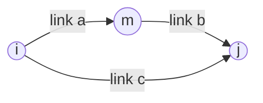

# How traffic is modelled

Traffic assignment is an old field with a settled vocabulary, and OpenGlassBox borrows from it without pretending to be one of its tools. This document has two halves. The first states the classical theory: how a road gets slower, and the family of algorithms that decide who drives where. The second says what the engine actually does, which formula lives in which method, and where it departs from the textbook on purpose.

The reference implementation of the theory is [CiudadSim](https://www.rocq.inria.fr/metalau/ciudadsim), a Scilab toolbox for traffic assignment; the notation below follows it.

## Notation

The road network is a directed graph $G = (N, A)$, where $N$ is the set of nodes (crossroads) and $A$ the set of links $a$ (street segments).

Travel demand is an **origin-destination matrix**: $d_{ij}$ is the number of trips from node $i$ to node $j$, expressed as vehicles per hour over the period considered.

Everything below is written with one piece of shorthand, the **indicator**, which turns a yes-or-no question into a number that can be summed:

$$\displaystyle \mathbb{1}[P] = \begin{cases} 1 & \text{if the proposition } P \text{ holds} \\ 0 & \text{otherwise} \end{cases}$$

It is worth naming because it is the only thing separating the formulas of the next three sections from one another. They all sum a demand multiplied by an indicator; what differs is the proposition inside the brackets.

For a pair $(i,j)$ there is a set of possible routes $K_{ij}$. Writing $f_k$ for the flow assigned to route $k$, and $\displaystyle \delta_{a,k} = \mathbb{1}\!\left[a \in k\right]$ for the indicator that route $k$ uses link $a$, the flow on a link is the sum of the flows of every route using it:

$$\displaystyle x_a = \sum_{(i,j)} \sum_{k \in K_{ij}} f_k \, \delta_{a,k}$$

Every algorithm below answers the same question: how to spread $d_{ij}$ over the routes of $K_{ij}$, knowing that the cost of a route depends on the flow it carries. That circularity is the whole difficulty. The flow determines the cost, the cost determines the flow, and what is wanted is a fixed point of the two.

### Example of $\delta_{a,k}$ and link flows

From origin $i$ to destination $j$, suppose two routes are available:



- Route $k_1$: $i \to m \to j$, using links $\{a, b\}$. Flow $f_{k_1} = 100$ veh/h.
- Route $k_2$: $i \to j$ directly, using link $\{c\}$ only. Flow $f_{k_2} = 50$ veh/h.

The indicator $\delta_{a,k}$ is 1 when route $k$ passes through link $a$, and 0 otherwise:

| Link $a$ | Route $k_1$ | Route $k_2$ | Meaning |
| --- | --- | --- | --- |
| $a$ | $\delta_{a,k_1} = 1$ | $\delta_{a,k_2} = 0$ | only $k_1$ uses the upper-left segment |
| $b$ | $\delta_{b,k_1} = 1$ | $\delta_{b,k_2} = 0$ | only $k_1$ uses the upper-right segment |
| $c$ | $\delta_{c,k_1} = 0$ | $\delta_{c,k_2} = 1$ | only $k_2$ uses the diagonal shortcut |

Applied to this pair $(i,j)$, the formula gives the flow on each link:

$$\displaystyle x_a = f_{k_1}\,\delta_{a,k_1} + f_{k_2}\,\delta_{a,k_2} = 100 \times 1 + 50 \times 0 = 100 \;\text{veh/h}$$

$$\displaystyle x_b = 100 \times 1 + 50 \times 0 = 100 \;\text{veh/h}, \qquad x_c = 100 \times 0 + 50 \times 1 = 50 \;\text{veh/h}$$

Link $c$ carries only the shortcut traffic; links $a$ and $b$ carry only the traffic that goes through $m$.

## Travel time on a road: the BPR function

Each link $a$ has a **performance function** $t_a(x_a)$ giving its travel time as a function of the flow it carries. The one used in practice comes from the US **B**ureau of **P**ublic **R**oads, which published it in 1964, and is known as the **BPR function**:

$$\displaystyle t_a(x_a) = t_a^0 \left(1 + \alpha \left(\frac{x_a}{c_a}\right)^{\beta}\right)$$

- $t_a^0$ is the free flow travel time, on an empty road;
- $c_a$ is the practical capacity of the link, the flow above which it starts to jam;
- $\alpha, \beta$ are shape parameters, standard values being $\alpha = 0.15$ and $\beta = 4$;
- $x_a$ is the current flow.

While $x_a \ll c_a$ the penalty term is near zero and $t_a \approx t_a^0$. As $x_a$ approaches and passes $c_a$, the exponent $\beta = 4$ makes the term explode. That brutality is the point: a jam does not build up linearly, it appears.

### What OpenGlassBox does

`Way::updateTravelTime`, in `src/Path.cpp`, is the BPR function, with $\alpha$ fixed at 0.15 in the code:

```cpp
void Way::updateTravelTime()
{
    if (m_type.capacity <= 0.0f)
    {
        m_travelTime = m_t0;
        return;
    }

    float const x = m_flow / m_type.capacity;

    m_travelTime = m_t0 * (1.0f + 0.15f * std::pow(x, m_type.beta));
}
```

$t_a^0$ is computed once per segment by `Way::updateMagnitude`, as the length of the road divided by the speed limit of its type. $c_a$ and $\beta$ are properties of a `WayType`, so a ruleset sets them per kind of road:

```text
segment Dirt color 0xAAAAAA speed 30 capacity 20 beta 4
```

A word on the units, because they are not the ones a traffic engineer would expect. Here the flow is a **number of agents currently on the road**, not a number of vehicles per hour, and the capacity is the number of agents a street carries before it starts to feel it. Nothing forbids the flow from exceeding the capacity: a saturated street stays passable, it just becomes expensive, and that is precisely what makes the [router](#the-router) send the next agent somewhere else instead of queueing everybody through the same place. Times are in seconds of game time, which the clock converts from ticks, so lengthening a tick does not make the city drive faster.

On an empty road, travel time is $t_a^0$. At capacity ($x_a = c_a$), it is 15 % higher. At twice the capacity ($x_a = 2c_a$), it is about three and a half times the free-flow time.

## AON: All-or-nothing

The simplest assignment, and the one a textbook Dijkstra or A\* performs without knowing it. For each pair $(i,j)$, compute the shortest route $k^{*}_{ij}$ under the **current** costs $t_a$, and put **all** of the demand on it:

$$\displaystyle x_a = \sum_{(i,j)} d_{ij} \, \mathbb{1}\!\left[a \in k^{*}_{ij}\right]$$

Compared with the general formula of the notation section, the inner sum over $K_{ij}$ has collapsed: one route out of the set carries $d_{ij}$ and every other carries nothing. That collapse is the whole of the algorithm, and the whole of its problem.

The structural flaw is that the cost used to find the route ignores the flow that is about to use it. Everybody runs the same computation against the same costs, so everybody converges on the same road, which saturates, while a slightly longer and completely empty alternative sits next to it.

This is the historical bug of SimCity (2013). Stone Librande of Maxis confirmed it publicly at the time: the agents insisted on the shortest possible route to each destination, causing enormous jams even when other roads were free. It was all-or-nothing, run once per agent, with no feedback from the flow.

## Frank-Wolfe and the Wardrop equilibrium

Wardrop's first principle (1952) defines the stable state of a traffic system: **no user can improve by unilaterally changing route**. Every used route between a pair $(i,j)$ has the same cost, and that cost is no greater than the cost of any unused route.

This is equivalent to the convex program known as the Beckmann formulation:

$$\displaystyle \min_{x} \; Z(x) = \sum_{a \in A} \int_0^{x_a} t_a(s)\, ds$$

subject to flow conservation, meaning the demand $d_{ij}$ is entirely carried, and $x_a \geq 0$.

Why an integral rather than the total cost $\sum_a t_a(x_a) \, x_a$? Because the objective is not the current total cost but a function whose gradient is exactly $t_a(x_a)$, and it is that property which makes the minimum of $Z$ coincide with the Wardrop equilibrium. Each user minimising their own trip happens to minimise this collective integral. It is a classical result, not a sum of costs.

Frank-Wolfe solves it by iterating, each iteration reusing an all-or-nothing:

1. Initialise $x^0$ with an all-or-nothing on the free flow costs $t_a^0$.
2. At iteration $n$: compute the current costs $t_a(x_a^n)$; run an all-or-nothing against those costs to get a target direction $y^n$; find the step $\lambda_n \in [0,1]$ minimising $Z(x^n + \lambda(y^n - x^n))$, a one-dimensional line search since $Z$ is convex along that segment; and set $x^{n+1} = x^n + \lambda_n (y^n - x^n)$.
3. Repeat until the iterates stop moving.

Geometrically, each iteration nudges the current solution towards the best all-or-nothing direction available at that moment. Because $Z$ is convex, the sequence converges to the unique Wardrop equilibrium.

The line search assumes the demand $d_{ij}$ stays fixed for the whole computation, which makes Frank-Wolfe an **offline** method: precomputing a map, planning an infrastructure. It is not something to run inside a simulation whose demand changes at every tick.

## MSA: method of successive averages

The **method of successive averages** keeps the structure of Frank-Wolfe, an all-or-nothing per iteration blended into the previous solution, and drops the line search. The step is decided in advance, from the iteration number alone:

$$\displaystyle \lambda_n = \frac{1}{n}, \qquad x^{n+1} = x^n + \frac{1}{n}\left(y^n - x^n\right)$$

Expanding the recurrence shows that $x^n$ is the running arithmetic mean of every all-or-nothing computed so far:

$$\displaystyle x^{n} = \frac{1}{n}\sum_{k=1}^{n} y^k$$

Hence the name. As $n$ grows, an individual all-or-nothing carries less weight and the solution settles. MSA reaches the same Wardrop equilibrium as Frank-Wolfe, generally more slowly since $1/n$ is not the optimal step, but it is far simpler and, more importantly, it never assumes the demand is frozen.

## Stochastic variants: logit, probit, Dial, Bell

Everything above, all-or-nothing included, rests on one assumption: every user of a pair $(i,j)$ knows the network perfectly and picks the minimum-cost route. Real drivers do not. Their perception of a cost is imperfect and heterogeneous, made of habit, ignorance and personal preference, and two drivers offered the same two routes will not always choose the same one.

The **logit** model replaces the indicator of the all-or-nothing formula with a probability that decreases with cost, so that the demand spreads over the whole of $K_{ij}$ instead of collapsing onto one route:

$$\displaystyle P_k = \frac{e^{-\theta t_k}}{\displaystyle\sum_{k' \in K_{ij}} e^{-\theta t_{k'}}}$$

where $t_k$ is the cost of route $k$ and $\theta > 0$ a sensitivity parameter. The two limits are worth keeping in mind, because they bracket everything in this document: as $\theta \to \infty$ the logit degenerates into all-or-nothing, and as $\theta \to 0$ the split becomes uniform and cost stops mattering at all.

The **probit** model starts from the perception rather than the outcome. Each user sees a cost $\tilde{t}_k = t_k + \varepsilon_k$ with $\varepsilon_k \sim \mathcal{N}(0, \sigma^2)$, and picks the route that looks cheapest to them:

$$\displaystyle P_k = \Pr\!\left(\tilde{t}_k \leq \tilde{t}_{k'}, \; \forall k' \neq k\right)$$

That is more faithful than the logit, and it has no closed form: it needs numerical integration or a Monte-Carlo simulation.

**Dial** (1971) and **Bell** (1995) are what make a logit assignment tractable at all. The obstacle is $K_{ij}$ itself, which can hold exponentially many routes, so neither algorithm enumerates it. Dial restricts the computation to *efficient* routes, those that never move away from the destination, and propagates the probabilities in one forward and one backward pass over the graph, in the spirit of dynamic programming. Bell reformulates the whole logit assignment as a flow problem solved by linear equations on the graph.

## What OpenGlassBox does instead

In CiudadSim, $x_a$ is an aggregate quantity the solver computes. OpenGlassBox does not have to simulate a flow, because the flow is already there and this is a great simplification. Here it is the `Agent` objects physically crossing the `Way` objects one by one; `Way::addAgent` and `Way::removeAgent` merely count them.

### The router

Classical assignment algorithms spread $d_{ij}$ over routes in one batch. OpenGlassBox does the opposite: each **agent** decides where to go, one at a time, when a rule sends it out with a load. Something has to answer that question on the road graph, and that component is the **router**.

A router is the object a `City` holds to plan agent trips. It implements the `IRouter` interface (`include/OpenGlassBox/Router.hpp`): given a crossroads, a target name, and a load, it searches the network for a building that accepts them and returns a `Route` (crossroads to follow, optional last leg along a segment, travel time). Agents call it when they need a next crossroads or when they check whether their current road is still the cheapest option. Edge costs are always read from `Way::travelTime`, so the router sees the traffic picture built by the four steps below.

Each city owns one router instance for the lifetime of the simulation (`City::setRouter`), so scratch buffers are allocated once rather than on every search. The shipped default is `Dijkstra` in `OpenGlassBox/DijkstraRouter.hpp`; attach it with `installDijkstraRouter` (see the [integration guide](integration.md)). You can replace it with any other `IRouter` without changing `City` or `Agent`.

So there is no assignment loop, and no iteration index. What is left of the MSA structure runs once per tick, in four steps.

### Step 1: counting, which plays the part of the all-or-nothing

Every `Way` holds `m_agentCount`, the number of agents currently on it, maintained by `Way::addAgent` and `Way::removeAgent` as agents enter and leave. At the end of a tick that count $n$ is the observation.

This is where the saving is. In CiudadSim, obtaining $y^k$ means running a full all-or-nothing over the whole network at every iteration. Here the agents have already performed that computation, individually, by walking: each of them routed on the shortest path under the weights of the moment, and the count of who ended up where *is* the result. Nothing has to be recomputed, only read.

### Step 2: updating the average flow

The observation is blended into the running flow with a fixed weight $\alpha$:

$$\displaystyle f \leftarrow (1-\alpha) f + \alpha \, n$$

That is `Way::smoothFlow`, called for every segment from `City::update` through `Path::smoothFlows`, **before any agent moves**, so that all of them route on the same picture of the network during the tick. The weight is `SimulationConfig::trafficSmoothing`, 0.05 by default and adjustable in the Traffic panel of the demo.

Without this step the whole population would swap between two parallel roads every tick: everyone sees road A empty, everyone moves to A, A is now jammed, everyone moves back to B.

### Step 3: updating the cost

`Way::updateTravelTime` re-evaluates the BPR function on the new flow, giving the segment its new travel time. Segments whose flow barely moved are skipped, which spares the power on every quiet street of the city on every tick, and a city has far more quiet streets than busy ones.

### Step 4: republishing the weights

There is nothing to publish, and that is the point. `Way::travelTime` is the single accessor every router reads, so the next search sees the new costs without anything being notified, invalidated or rebuilt. Agents do not re-plan on the spot either: they reconsider on their own period, which step 3 of the following ticks keeps feeding.

### Why this is not MSA

The resemblance is real but superficial, and worth being precise about, because the two differ in exactly one term. MSA averages with a **decreasing** weight $\lambda_k = 1/k$:

$$\displaystyle f^{k+1} = (1-\lambda_k) f^k + \lambda_k y^k, \qquad \lambda_k = \frac{1}{k}$$

Because $\lambda_k$ shrinks, MSA converges to a Wardrop equilibrium. A fixed $\alpha$ converges to nothing: it is a low-pass filter, not a solver. It damps the oscillation and that is all it does.

That is a choice, not an approximation. A vanishing step is right for a **static** demand, where the system is supposed to freeze onto the exact equilibrium. A city is not static: a district appears, a road is demolished, a rush hour starts. A fixed step keeps the network responsive for ever, at the price of never settling on an equilibrium it would have been wrong to settle on. This is a game, not an assignment solver.

The same exponential moving average is the mechanism proposed for smoothing macroeconomic indicators; see the [economy documentation](economy.md).

### Finding a destination: a search with no goal

The default router, `Dijkstra`, does two things a textbook shortest path does not.

The first is the cost: an edge costs its travel time under the current traffic, not its length. A short road carrying two hundred agents costs more than a long empty one.

The second is stranger. **There is no goal.** An agent does not know which building it is going to; it knows the *name* of what it is looking for. `Dijkstra::findRoute` walks the network outwards from the crossroads the agent stands at and stops at the first building that answers to that name **and has room for the load**, which `Unit::accepts` decides. A building standing along a street is kept as a candidate rather than accepted at once, because a crossroads one hop away may hold a cheaper one.

Having no goal is also why there is no A\* here: an A\* estimate needs something to aim at. Searching outwards until the predicate is satisfied is already the best that can be done without a target, since the search stops as soon as it has expanded everything cheaper than its answer, and nothing cheaper can be hiding further out.

Two consequences follow, and both are visible in the demo. Two agents leaving the same door a minute apart may be sent to different shops, because the traffic changed in between. And an agent whose itinerary was computed a while ago replaces it when the road it is on has become worse than the alternative.

Comparing the two costs a whole graph search, so it does not happen on every tick: `pathCheckTicks` is how often an agent bothers to look, and `pathCostDeviation` is how much worse its road has to be before it switches. When the comparison does say the alternative is better, the itinerary that search produced is the one the agent takes: it is not searched for a second time. Lowering `pathCheckTicks` to one is the quickest way to bring a large city to its knees.

That "first acceptable building" criterion is the destination-choice counterpart of all-or-nothing, and it had the same weakness until the room a building has left started accounting for the agents already heading towards it. See [reserving the destination](#reserving-the-destination) below.

### Reading the relative gap

Since the engine never solves for an equilibrium, it measures how far it is from one. The **relative gap** compares what the agents actually pay against what they would pay on the cheapest routes available at the current travel times:

$$\displaystyle \mathrm{Relgap} = \frac{\mathrm{TSTT} - \mathrm{SPTT}}{\mathrm{TSTT}}$$

TSTT is the total system travel time and SPTT the shortest path travel time. `Simulation::relativeGap` sums the remaining cost of the agents for the first, and asks each of them for its `rerouteCost` for the second. Near zero, the agents are already on their cheapest itineraries and the network has settled. It is a diagnostic to watch in the Traffic panel, not the stopping criterion of a solver.

Two conditions make that ratio mean anything, and both are easy to break.

The first is that the two sums must run over the **same agents**. An agent that is wandering has no remaining cost to contribute, so its alternative must be left out too, and one whose reroute reaches nothing has no alternative, so its remaining cost must be left out in turn. Summing over two different populations measures the difference between them rather than the distance to equilibrium.

The second is that an agent must not be **measured against itself**. It holds a place at its destination, and `Unit::accepts` counts that place, so a search made on its behalf without lifting its own claim finds its destination full and answers with a dearer building. Every agent then looks as though it would gain by rerouting to somewhere it is already going, which shows up as SPTT larger than TSTT. That is why the measurement goes through `Agent::rerouteCost`, which lifts the claim, asks, and puts it back, rather than calling `IRouter::shortestPathCost` directly.

With both respected, SPTT stays below TSTT except in one genuine case: an agent whose destination filled up while it was driving, whose next best building really is farther. The panel says so rather than showing a negative gap.

**Example.** Three agents are still on the road, each heading for a building that accepts its load. Their **remaining cost** is the travel time left on the itinerary they chose when they set out (TSTT contribution). **Shortest path cost** is what the router would charge *today*, from the same crossroads, with the traffic as it is now (SPTT contribution):

| Agent | Remaining cost (TSTT) | Shortest cost today (SPTT) | Interpretation |
| --- | --- | --- | --- |
| A | 120 s | 120 s | already on the cheapest route |
| B | 80 s | 60 s | a parallel road opened up since departure |
| C | 100 s | 50 s | still on a road that became congested |

$$\displaystyle \mathrm{TSTT} = 120 + 80 + 100 = 300 \;\text{s}, \qquad \mathrm{SPTT} = 120 + 60 + 50 = 230 \;\text{s}$$

$$\displaystyle \mathrm{Relgap} = \frac{300 - 230}{300} \approx 0.23 \;\;(23\%)$$

About a quarter of the remaining travel time is "extra" compared with rerouting everyone instantly at current prices. The city is not in equilibrium yet, but it is not catastrophically off either. If every agent were on its cheapest route today, each remaining cost would match its shortest cost, so TSTT = SPTT and **Relgap = 0**. After a sudden jam on one artery, the gap can spike until agents reconsider on their next `pathCheckTicks`.

The table below is a rule of thumb for reading the value in the Traffic panel. Assignment solvers often stop near 1 %; here the gap is a **live** measure and never forced to zero, because demand and travel times keep moving.

| Relgap | Situation | What it usually means |
| --- | --- | --- |
| **0 %** | TSTT = SPTT | Every sampled agent is on the cheapest route available *right now*. Wardrop-like for the trips still on the road. |
| **0–5 %** | Near equilibrium | Routing has largely settled. Small differences come from agents between `pathCheckTicks`, sampling noise, or a destination that just filled up. |
| **5–15 %** | Normal churn | Typical for a busy city. Some agents are still on itineraries chosen before traffic shifted; others could save a noticeable slice of time by rerouting. |
| **15–30 %** | Clearly off | Many agents pay substantially more than today's shortest path: fresh congestion, a new road not yet used, or `pathCheckTicks` set too high. |
| **30 %+** | Strong mismatch | Often right after a shock (closed road, rush of new agents, capacity collapse on one link). Expect visible jams and agents committed to bad routes until they re-check. |

These bands are indicative, not thresholds to tune for. A city can sit at 10 % for long stretches and still look healthy; what matters is whether the gap **drifts down** after a disturbance and whether jams match what you see on the map.

Being a diagnostic is what its cost has to be measured against, and the cost is a whole graph search per agent examined. Two things keep it affordable while a panel reads it on every frame. The result is memoized until the next tick, since nothing it depends on can move within one. And the agents are sampled rather than all walked, at most `SimulationConfig::relativeGapSamples` of them, taken at a regular stride so that the sample covers the whole population instead of whichever end of the list the loop starts at. The gap being a ratio of two sums scaled the same way, a regular sample estimates it without any correction.

## What we deliberately do not do

None of the four stochastic algorithms above is implemented, and the reason is that the property they exist to provide is already there by other means.

What a logit or a probit buys is **dispersion**: two agents with the same origin and the same errand should not invariably make the same choice. A static assignment has to manufacture it, because it computes one answer for an entire origin-destination pair at once. Here it falls out of the simulation being a simulation. Agents route at different moments rather than in one batch; the travel times have moved in between, because others drove meanwhile; and the destination is whichever building has room when the search runs, not a fixed node. Two residents leaving the same door a minute apart already end up in different shops.

The choice is therefore between dispersion that emerges from the mechanics and dispersion computed by a model layered on top of them. The second costs a route enumeration, or Dial's two passes to avoid one, on every search, and adds a $\theta$ to calibrate, for a difference no player could point at.

One cheap approximation is worth recording, being the only one that would fit the engine. Perturbing each edge cost by a factor $1 + \sigma\varepsilon$, with $\varepsilon$ drawn from a hash of the agent identifier and the way identifier, is a probit for the price of a hash: deterministic, so saves and tests stay reproducible, needing no storage, and giving each agent a stable driving personality rather than fresh noise at every search. It is not implemented because it would mean passing the agent identity into `IRouter::findRoute`, which is changing an interface for a refinement. Note also that it would raise the relative gap by construction, that gap being the measure of how far agents are from their shortest routes.

## Why there is no assignment solver

The obvious next step, from the shape of the four steps above, is to promote them into a proper solver. That step was considered and rejected, and this section records why, so that the question does not have to be reopened from scratch.

### What the class would have been

`TrafficAssignmentSolver` would have owned the three things the current design has nowhere to put:

- the **flow buffer**. Today there is one `m_flow` per `Way`, updated in place. A real MSA has to keep it separate from the observed count $y^k$ of the current window, since it needs both at once to form the average.
- the **iteration counter** $k$. It does not exist, because there is no iteration: smoothing happens once per tick, unconditionally.
- the **step policy**, that is the choice between $\lambda_k = 1/k$ and a fixed $\eta$. Today this is not a choice but a hard-coded formula.

It would have run over a window of $N$ ticks, taken the observed counts as its $y^k$, updated the average with a vanishing step, recomputed the travel times and let the router read them. The hook was available: `City::update`, in the place `Path::smoothFlows` occupies, or `World::update` for an average spanning several cities. Nothing else would have had to change, `Way::travelTime` being already the single point every router reads.

### Why we do not want it

**There is no origin-destination matrix to solve for.** Everything in the theory above is defined over $d_{ij}$, trips from node $i$ to node $j$. OpenGlassBox has no such object and could not easily have one: demand is emergent, an agent being born from a rule carrying a *name* to look for, not a destination node. Its destination is decided during the search, by whichever building has room. Feeding a solver would mean first inventing an OD matrix by aggregating observed trips, solving it for aggregate link flows, and then reconciling the result with the per-agent counts already in hand. That is a round trip whose output is an approximation of its own input.

**It would create a second source of truth.** The solver's $x_a$ and the actual number of agents on the street would drift apart, since only the latter is constrained by agents physically being somewhere. The player sees the agents. A cost derived from a flow that disagrees with them is a cost that is wrong in exactly the situations anyone would notice.

**It would fix the wrong problem.** An equilibrium solver spreads flow across *routes*. The defect actually visible in the simulation is the choice of *destination*: agents converging on the same building because it had room when each of them looked. That is addressed by reserving the room, described below, and no amount of link-flow equilibrium would have touched it.

To this add the reason given above for the fixed step: a vanishing $\lambda_k$ is right for a static demand and wrong for a city where a district appears, a road is demolished, a rush hour starts.

### A cheaper calibration reference

If the continuous BPR curve proves hard to tune, the official SimCity (2013) patch is worth knowing about. Maxis weighted roads by **capacity tiers at 25 %, 50 % and 75 %**: crossing each threshold makes a road less attractive to the following agents. That is the BPR curve discretised into three steps, and it is easier to reason about than $\alpha$ and $\beta$.

## Reserving the destination

The counterpart of all-or-nothing on the destination side, and the one place it did have to be fixed.

`Unit::accepts` used to ask a boolean question: is there any room left. A shop missing one crate and a shop missing twenty both answered yes, so the nearer one won every time. Worse, twenty agents dispatched on the same tick all saw the same single free slot and were all sent to claim it; nineteen arrived to find it taken.

A `Unit` therefore counts the agents currently travelling towards it, and `accepts` tests the room against the stock **plus** those already on their way. The count is maintained through a single point in `Agent`, so that an agent releases its claim whether it delivers, gives up, is destroyed, or merely recomputes its itinerary and picks somewhere else. An agent that loses its route and starts wandering releases immediately rather than holding a slot it may never use.

The cost is one integer per building and one comparison per acceptance test. What it buys is that the twentieth agent sees a shop that is already spoken for and looks elsewhere, which is the behaviour the score of the [economy documentation](economy.md#choosing-a-destination) was meant to produce, obtained without widening the search.

## Where the coefficients live

| Coefficient | Where |
| --- | --- |
| $\alpha = 0.15$ of the BPR function | hard-coded in `Way::updateTravelTime`, `src/Path.cpp` |
| $\beta$, capacity $c_a$, speed limit | `WayType` in `include/OpenGlassBox/Types.hpp`, set per segment type in the `.ogs` ruleset |
| Smoothing weight $\alpha$ of the moving average | `SimulationConfig::trafficSmoothing`, `include/OpenGlassBox/Config.hpp` |
| Route re-examination period and threshold | `SimulationConfig::pathCheckTicks`, `pathRecalcTicks`, `pathCostDeviation` |
| Sample size of the relative gap | `SimulationConfig::relativeGapSamples`, zero meaning every agent |

Nothing here is a script keyword beyond what `segment` already accepts. See the [script language reference](script.md) and the [engine documentation](engine.md).
